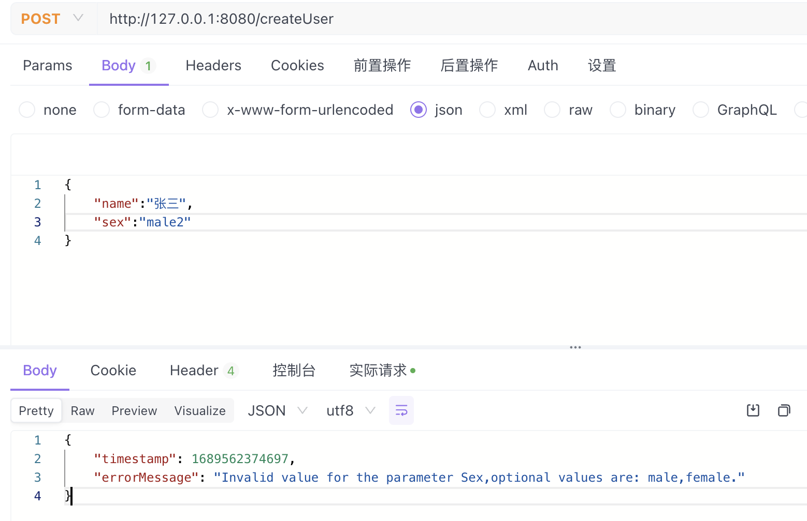

---
tags:
- Hibernate Validator
- Springboot
---

## 前言

Hibernate Validator是一个基于Java的验证框架，它是Java Bean验证API（JSR 380）的实现，并提供了一套全面的验证约束和功能，用于验证Java对象。Hibernate Validator允许自定义注解来定义验证约束。通过自定义注解，可以根据特定的业务需求创建自定义的验证规则，并将其应用于Java类的属性、方法或类本身。本文主要介绍如何基于自定义注解实现校验参数在枚举范围内，对于Hibernate Validator本身不再作过多介绍。
## 实现步骤
### 创建新注解
创建一个新的注解，用于定义自定义验证约束，使用@Constraint注解来指定自定义验证器类。注解中的enumClass()方法用于指定所需验证的枚举类，fieldName()方法表示字段名称，当参数中有多个枚举校验时方便提示具体的字段。
```java
package com.example.annotations;

import com.example.validator.EnumValidator;

import javax.validation.Constraint;
import javax.validation.Payload;
import java.lang.annotation.ElementType;
import java.lang.annotation.Retention;
import java.lang.annotation.RetentionPolicy;
import java.lang.annotation.Target;

/**
 * @author zouzhangpeng
 */
@Target({ElementType.FIELD})
@Retention(RetentionPolicy.RUNTIME)
@Constraint(validatedBy = EnumValidator.class)
public @interface ValidateEnum {

    Class<? extends Enum<?>> enumClass();

    String fieldName();

    String message() default "Invalid value for the parameter {fieldName},optional values are: {enumValues}.";

    Class<?>[] groups() default {};

    Class<? extends Payload>[] payload() default {};
}
```
### 创建验证器类
创建验证器类：实现ConstraintValidator接口，编写自定义验证逻辑，这里除了参数是否在枚举范围内，还重写了错误提示，将可用的枚举值放到了错误消息中。
```java
package com.example.validator;

import com.example.annotations.ValidateEnum;
import org.apache.commons.lang3.StringUtils;

import javax.validation.ConstraintValidator;
import javax.validation.ConstraintValidatorContext;
import java.util.Arrays;
import java.util.Objects;
import java.util.stream.Collectors;

/**
 * @author zouzhangpeng
 */
public class EnumValidator implements ConstraintValidator<ValidateEnum, String> {

    private Class<? extends Enum<?>> enumClass;
    private String fieldName;

    @Override
    public void initialize(ValidateEnum constraintAnnotation) {
        enumClass = constraintAnnotation.enumClass();
        fieldName = constraintAnnotation.fieldName();
    }

    @Override
    public boolean isValid(String s, ConstraintValidatorContext context) {
        if (StringUtils.isBlank(s)) {
            return true;
        }

        // 是否在枚举范围内
        boolean isValid =
                Arrays.stream(enumClass.getEnumConstants()).anyMatch(value -> Objects.equals(value.toString(), s));

        if (!isValid) {
            String enumValues =
                    Arrays.stream(enumClass.getEnumConstants()).map(Enum::toString).collect(Collectors.joining(","));
            if (StringUtils.isNotBlank(fieldName)) {
                fieldName = StringUtils.capitalize(fieldName);
            }
            // 禁用原来的提示，重写提示并在提示中给出可用的枚举
            String errorMessage = context.getDefaultConstraintMessageTemplate().replace("{fieldName}", fieldName)
                    .replace("{enumValues}", enumValues);

            context.disableDefaultConstraintViolation();
            context.buildConstraintViolationWithTemplate(errorMessage).addConstraintViolation();
        }
        return isValid;
    }
}
```
### 使用注解
编写一个测试接口并使用该注解。
```java
package com.example.controller;

import org.springframework.validation.annotation.Validated;
import org.springframework.web.bind.annotation.PostMapping;
import org.springframework.web.bind.annotation.RequestBody;
import org.springframework.web.bind.annotation.RestController;

import com.example.dto.UserDTO;
import com.example.model.ResponseEntity;

import lombok.extern.slf4j.Slf4j;

/**
 * @author zouzhangpeng
 */
@Slf4j
@RestController
public class UserController {

    @PostMapping("/createUser")
    public ResponseEntity<Void> createUser(@Validated @RequestBody UserDTO dto){
        log.info("params:{}",dto);
        return ResponseEntity.success();
    }
}

```
这里是对性别sex字段进行校验。
```java
package com.example.dto;

import com.example.annotations.ValidateEnum;
import com.example.enums.Sex;

import lombok.Data;
import lombok.ToString;

/**
 * @author zouzhangpeng
 */
@ToString
@Data
public class UserDTO {

    private String name;

    @ValidateEnum(enumClass = Sex.class)
    private String sex;
}
```
```java
package com.example.enums;

public enum Sex {

    /**
     * 男性
     */
    male,

    /**
     * 女性
     */
    female

}
```
### 测试
通过接口工具测试，


