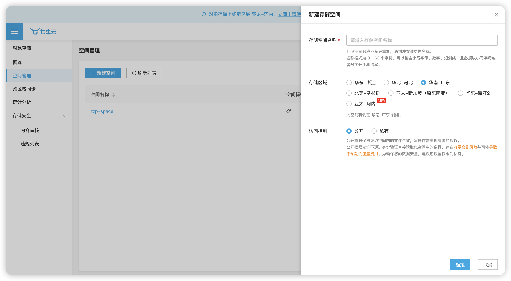
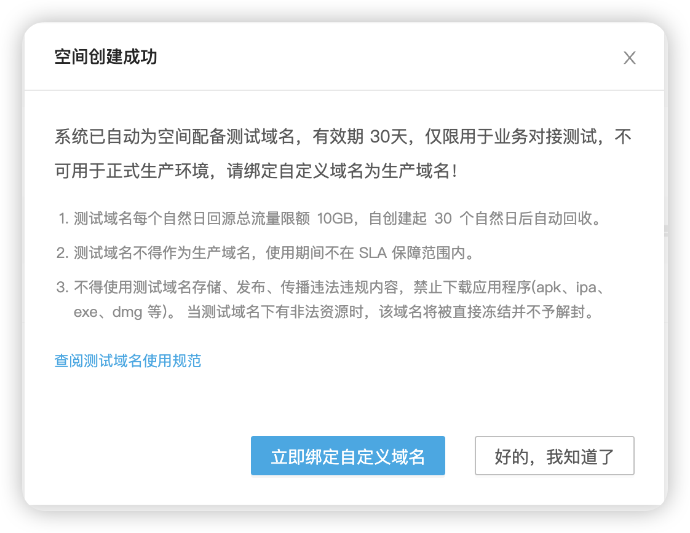
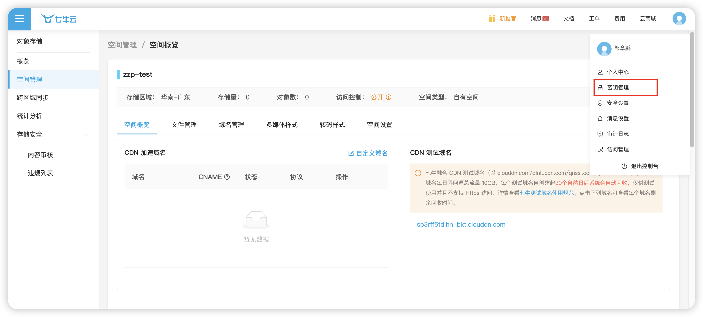
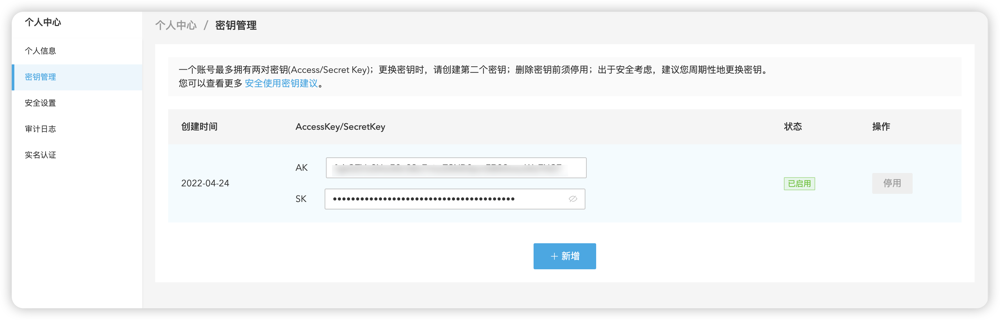
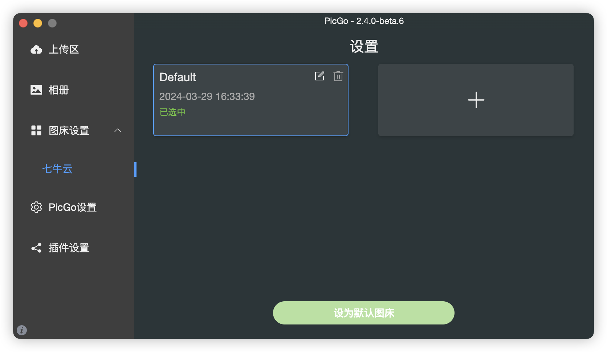
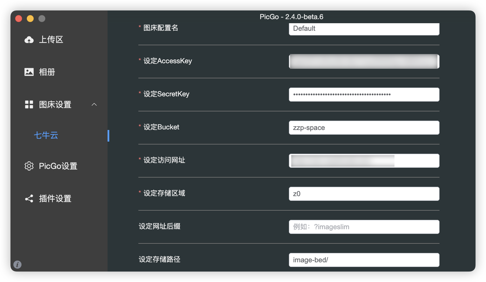
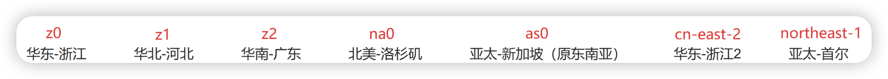
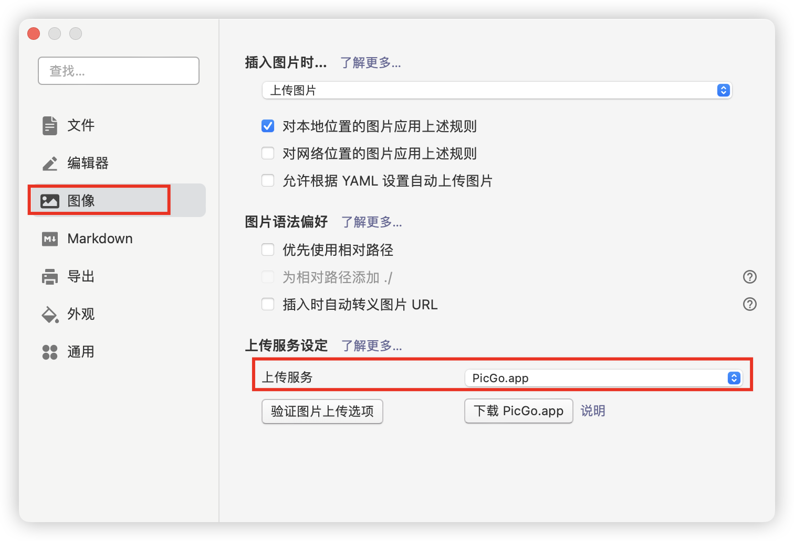
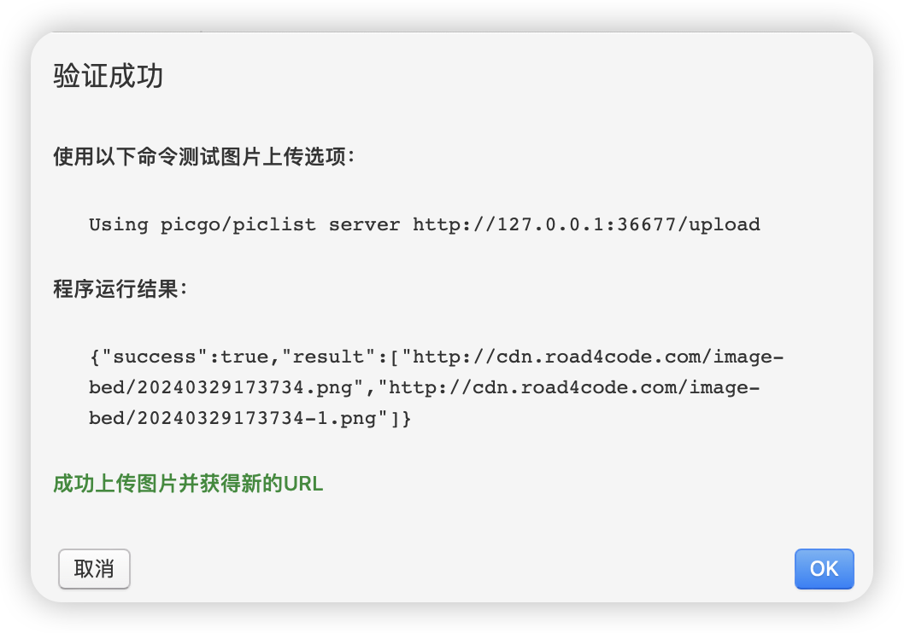

---
tags:
- typora
- 图床
---

## 前言

Typora的图床功能主要是通过PicGo软件实现的。

## 安装PicGo

PicGo是github上的开源项目，可以直接从[git releases](https://github.com/Molunerfinn/PicGo/releases)页面下载。如果不能访问github，也可以通过一下方式下载。

| 下载源                                        | 地址/安装方式                                               | 平台       |
| --------------------------------------------- | ----------------------------------------------------------- | ---------- |
| GitHub Release                                | https://github.com/Molunerfinn/PicGo/releases               | All        |
| [山东大学镜像站](https://mirrors.sdu.edu.cn/) | https://mirrors.sdu.edu.cn/github-release/Molunerfinn_PicGo | All        |
| [Scoop](https://scoop.sh/)                    | `scoop bucket add extras` & `scoop install picgo`           | Windows    |
| [Chocolatey](https://chocolatey.org/)         | `choco install picgo`                                       | Windows    |
| [Homebrew](https://brew.sh/)                  | `brew install picgo --cask`                                 | macOS      |
| [AUR](https://aur.archlinux.org/packages/yay) | `yay -S picgo-appimage`                                     | Arch-Linux |

### 问题

* 苹果芯片Mac安装提示“已损坏，无法打开”

打开终端输入一下命令按照提示输入密码。

```shell
sudo xattr -d com.apple.quarantine "/Applications/PicGo.app"
```

## 创建图床

### 创建对象存储空间

登陆七牛云控制台后，选择对象存储并新建一个空间，因为是作为图床使用，访问控制选择公开（注意流量盗刷风险）。



点击确定后会给一个30天的域名，后面需要修改成我们自己的域名。



创建完成后这个空间就作为图床了。

### 创建密钥

右上角点击头像后进入密钥管理。



新建一个密钥。



## PicGo配置七牛云图床

打开PicGo，在图床设置中选择七牛云，选中default，然后将其设为默认图床，否则后面错误日志会提示Error: You must be logged in to use。进入编辑界面。



填入七牛云信息，其中Bucket为空间名，AccessKey和SecretKey是之前设置的密钥信息，访问网站即之前的域名。如果想要存储到某个文件夹下，需要在空间下新建一个文件夹，配置到PicGo图床设置中的存储路径（**结尾需要加个“/”**）。



存储区域代码如图。



## Typora配置PicGo

在打开Typora的设置，选中图像的上传服务设定，在上传服务中选择PicGo。



点击图片上传选项，验证是否成功。



现在在Typora中复制图片就会直接上传到七牛云了。