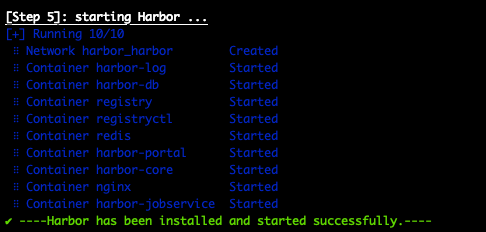
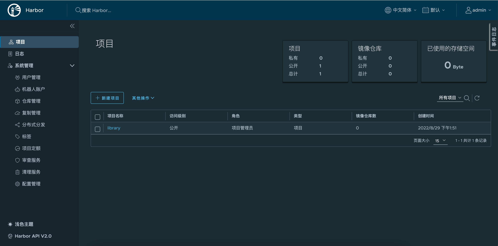

---
tags:
- harbor
- docker
- 镜像
---


## 简介

Harbor是一个用于存储和分发Docker镜像的企业级Registry服务器，通过添加一些企业必需的功能特性，例如安全、标识和管理等，扩展了开源Docker Distribution。作为一个企业级私有Registry服务器，Harbor提供了更好的性能和安全。提升用户使用Registry构建和运行环境传输镜像的效率。Harbor支持安装在多个Registry节点的镜像资源复制，镜像全部保存在私有Registry中， 确保数据和知识产权在公司内部网络中管控。另外，Harbor也提供了高级的安全特性，诸如用户管理，访问控制和活动审计等。

## 安装条件
安装Harbor之前必须保证系统已安装**docker**和**docker-compose**。
## 安装步骤
### 下载安装包
到[Harbor官方地址](https://github.com/goharbor/harbor/releases)下载最新版安装包。


### 解压安装包
```shell
tar -zxf harbor-offline-installer-v2.6.0-rc3.tgz
```
### 修改配置
进入目录 然后将harbor.yml.tmp复制一份并该命为harbor.yml，harbor.yml就是harbor的配置文件。
```shell
cd harbor
cp harbor.yml.tmpl harbor.yml
vim harbor.yml
```

文件开头的hostname一定要修改，可以改成系统的实际地址。配置中注释也说得很清楚，不能使用localhost或者127.0.0.1，因为harbor需要被外部客户端访问。
```yaml
# The IP address or hostname to access admin UI and registry service.
# DO NOT use localhost or 127.0.0.1, because Harbor needs to be accessed by external clients.
hostname: 172.20.163.30
```
http和https配置根据实际需要二者取其一，另一个注释掉。
```yaml
# http related config
http:
  # port for http, default is 80. If https enabled, this port will redirect to https port
  port: 80

# https related config
#https:
  # https port for harbor, default is 443
  #port: 443
  # The path of cert and key files for nginx
  #certificate: /your/certificate/path
  #private_key: /your/private/key/path
```
UI界面的管理员密码，默认Harbor12345，可以根据实际需求修改。
```yaml
# Remember Change the admin password from UI after launching Harbor.
harbor_admin_password: Harbor12345
```
其他配置可保持不变或根据需求修改。
### **执行安装命令**
```shell
# 预处理命令，会创建一些文件夹，初始化一些文件
./prepare
```
```shell
# 真正的安装命令，--with-trivy表示启用镜像扫描功能并使用trivy扫描器
./install.sh --with-trivy
```
当出现下图信息即表示安装成功。


### 访问UI界面。
打开浏览器访问，ip为操作系统ip地址，端口为配置文件中http或https配置的端口。用户名为admin，密码为配置文件中配置的密码。


